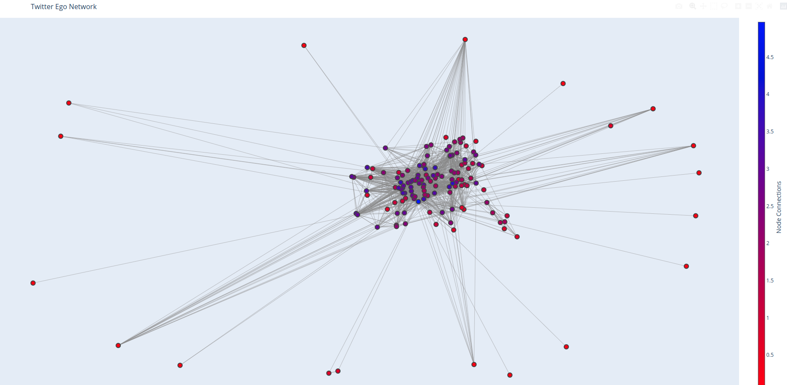

# Ego Networks

    

## Objectives

An effort to study information flow and belief propogation through ego networks. The project aims to create a generic extensible framework for capturing, defining and curating measures for any ego network.

-   We start with creating the two step neighborhood network for twitter social media, for the out neighbors. However, worth noting that the information flow is inward.

    

-   This could extend to `heterogenous nodes` of multiple entities such as people, content etc.
-   This could also extend to a complex [multiplex network](https://cosnet.bifi.es/network-theory/multiplex-networks/) that captures multiple relationship types. Information would flow through multiple layers of the network with differing diffusion patterns.

    

-   Primary goal is to study (through observation and simulation) information and it's effects on users, potentially through a naive [Degroot Learning](https://en.wikipedia.org/wiki/DeGroot_learning) or through [Bayesian Learning](https://en.wikipedia.org/wiki/Mathematical_models_of_social_learning). 
    -   [Stanford](https://github.com/lejinvarghese/graph_data_science/blob/master/docs/social_economic_networks/w6-learning.pdf)
    -   [MIT](https://economics.mit.edu/files/4902)

    

-   Secondary goal (and perhaps more immediate) is to fully take control of personalized recommendations of entities from the second step network.
