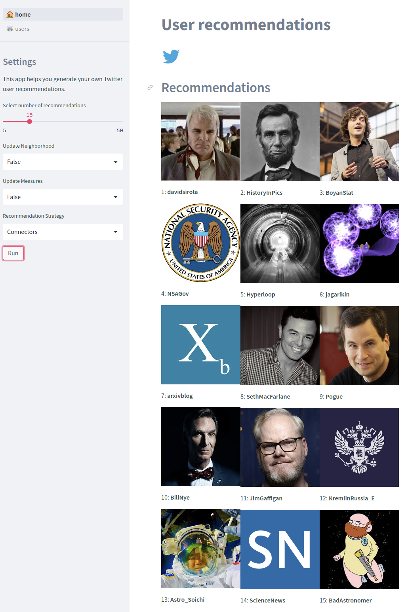

# Ego Networks

[](https://codecov.io/gh/lejinvarghese/ego_networks)

<p align="center">
    
</p>

## Twitter User Recommendations


<p float="left" align="middle">
        
        
        
</p>

## Objectives

This project is a broad effort to give an individual control over what information they consume, what sub communities they're connected, and how information diffusion over networks might affect their perspective. We want to study information flow and belief propogation through complex networks, help people find `highly personalized communities` from their immediate ego network, but also `avoid echo chambers, filter bubbles`.

-   We start by creating the two step neighborhood network for `Twitter`.
    -   We only consider the `out neighbors`, i.e. who the user follows, the intent being that it's who the user follows matter more than who follows the user.
    -   The `information flow` however is inward.
-    The framework is designed to be extensible to other social networks and other types of networks.
     -   This could extend to a `heterogenous network` of multiple entities such as `people, content, communities, ideas` and relationships between them.
     -   This could also extend to a complex [multiplex network](https://cosnet.bifi.es/network-theory/multiplex-networks/) that captures multiple relationship types. Information would flow through multiple layers of the network with differing diffusion patterns.

<p align="center">
    
</p>

-   Primary goal is to study (through observation and simulation) information diffusion, learning and it's effects on users, potentially through [Degroot Learning](https://en.wikipedia.org/wiki/DeGroot_learning) or through [Bayesian Learning](https://en.wikipedia.org/wiki/Mathematical_models_of_social_learning) models.
    -   [Stanford](https://github.com/lejinvarghese/graph_data_science/blob/master/docs/social_economic_networks/w6-learning.pdf)
    -   [MIT](https://economics.mit.edu/files/4902)

<p align="center">
    
</p>


## Run

### Setup

```bash
python3 -m venv .venv
source .venv/bin/activate
pip install -r requirements.txt
```

### Source Code

```bash
source .venv/bin/activate
python3 -m src.main
```

### Streamlit Application

```bash
source .venv/bin/activate
streamlit run app.py
```


## Inspiration

- [Gobo](https://www.media.mit.edu/projects/gobo/overview/) by Ethan Zuckerman et al., MIT Media Lab
  - [GitHub: inactive](https://github.com/mitmedialab/gobo)