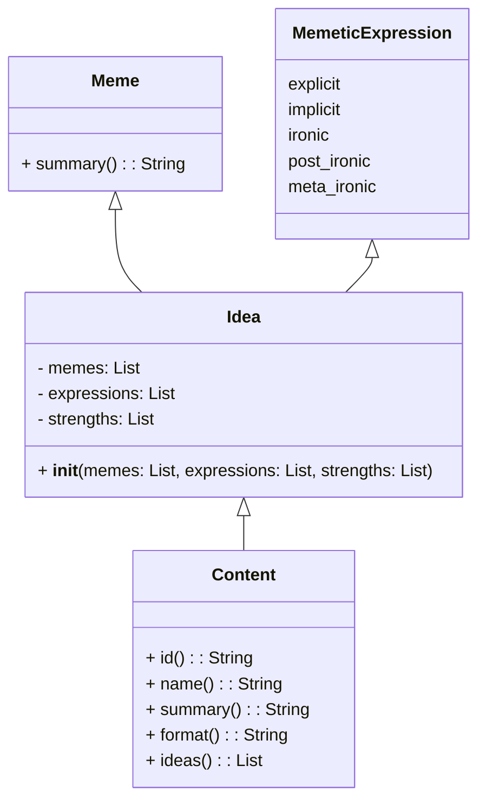

# General

Content today is dispersed across fragmented platforms, and systems, some measured, most not.  Content here refers to movies, shows, books, podcasts, videos, reels, tweets, pictures, music and so on. Content as such can be seen as much higher level evolutionary abstractions emerging above  `memes`.  

