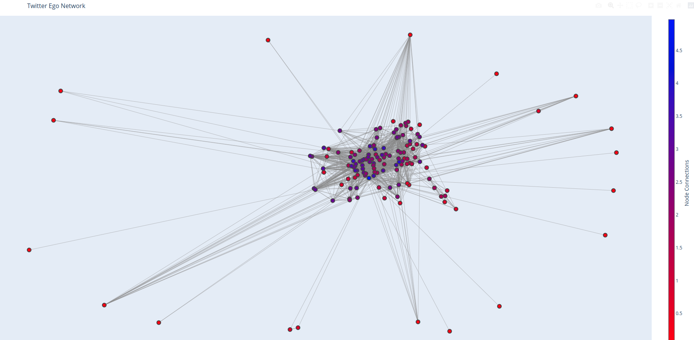

# Twitter Ego Network

[](https://codecov.io/gh/lejinvarghese/graph_data_science)

## Goal

Graph of my Twitter ego network to find appropriate recommendations.



## Activate Environment

```bash
source activate.sh
```
